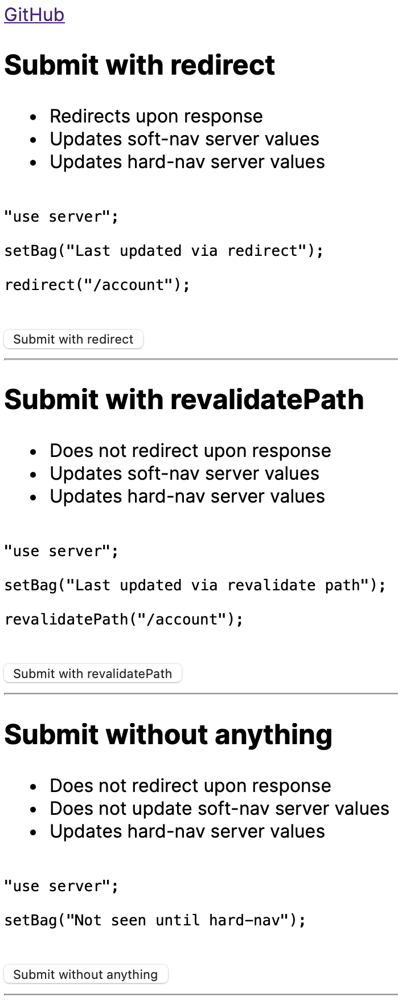

# Server Action Demo

Simple demo for understanding how Next deals with caching Server Components

- `redirect()`
- `revalidatePath()`
- Default behaviour

---

Clone and run it locally. It uses an in-memory "server". Feel free to submit a PR to make it deployable :)

---
## `/account`  

---
## `/account/edit`  

---
Was a question from [this Reddit thread](https://www.reddit.com/r/nextjs/comments/16lnjaz/comment/k14u3h0/)
